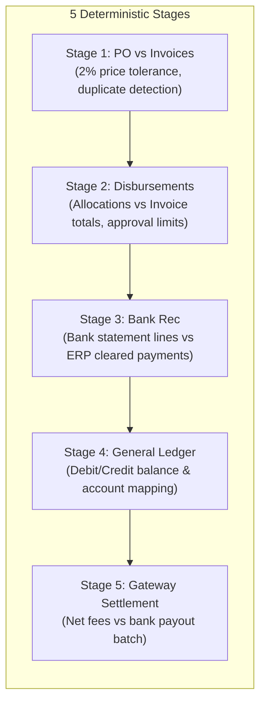
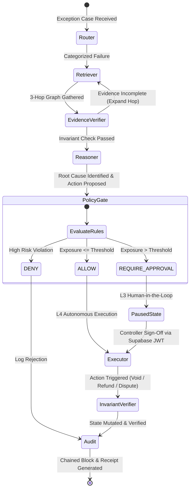

# LEDGEROS MASTER ARCHITECTURE SPECIFICATION
**Autonomous Finance Controller & Revenue Recovery Platform**

---

## 1. High-Level Architectural Topology

LedgerOS decouples financial intelligence from underlying enterprise databases and payment gateways using a four-tier architecture:

```text
┌──────────────────────────────────────────────────────────────────────────────────────────────────┐
│                                   TIER 1: PRESENTATION & CONTROL ROOM                            │
│   Next.js 15 Command Center  •  Financial Detective Lab  •  Governance Queue  •  Audit Explorer  │
└────────────────────────────────────────────────┬─────────────────────────────────────────────────┘
                                                 │ HTTPS / REST + SSE
┌────────────────────────────────────────────────▼─────────────────────────────────────────────────┐
│                                     TIER 2: API & GOVERNANCE GATEWAY                             │
│   FastAPI Engine  •  Supabase JWT (RS256) Auth  •  Server-Side RBAC  •  Audit Verification API   │
└────────────────────────────────────────────────┬─────────────────────────────────────────────────┘
                                                 │
┌────────────────────────────────────────────────▼─────────────────────────────────────────────────┐
│                                 TIER 3: CORE AI & DETERMINISTIC CONTROLLER                       │
│  ┌───────────────────────────┐  ┌───────────────────────────┐  ┌──────────────────────────────┐  │
│  │   Deterministic Engine    │  │   Typed Provenance Graph  │  │    LangGraph StateGraph      │  │
│  │   • 5-Stage Rec Matcher   │  │   • 3-Hop Foreign Key Walk│  │    • Causal Root-Cause Agent │  │
│  │   • Zero LLM Math         │  │   • Evidence Subgraphs    │  │    • Action Planning Loop    │  │
│  └─────────────┬─────────────┘  └─────────────▲─────────────┘  └──────────────┬───────────────┘  │
│                │                              │                               │                  │
│                ▼                              └───────────────┬───────────────┘                  │
│  ┌───────────────────────────┐                                │                                  │
│  │  Financial Exceptions     │────────────────────────────────┘                                  │
│  │  (F01-F15 Anomaly Cases)  │                                                                   │
│  └───────────────────────────┘                                                                   │
│                                                                                                  │
│  ┌───────────────────────────┐  ┌───────────────────────────┐  ┌──────────────────────────────┐  │
│  │ Policy Gate (FIN-POL-v2.0)│  │   Action Executor & Verif │  │  SHA-256 Chained Audit Ledger│  │
│  │ • L0-L4 Autonomy Rules    │─►│   • Bounded Invariant Chk │─►│  • Immutable Blockchain      │  │
│  │ • Exposure Thresholds     │  │   • State Mutation Check  │  │  • Decision Receipts Engine  │  │
│  └───────────────────────────┘  └───────────────────────────┘  └──────────────────────────────┘  │
└────────────────────────────────────────────────┬─────────────────────────────────────────────────┘
                                                 │
┌────────────────────────────────────────────────▼─────────────────────────────────────────────────┐
│                               TIER 4: CANONICAL DOMAIN & DATA ADAPTER LAYER                      │
│                                                                                                  │
│       Canonical Invoices  •  Canonical Payments  •  Canonical POs  •  Canonical GL Entries      │
│                                                ▲                                                 │
│                        ┌───────────────────────┴───────────────────────┐                         │
│                        │       Schema Mapping & Transform Engine       │                         │
│                        └───────────────────────▲───────────────────────┘                         │
│                                                │                                                 │
│               ┌────────────────────────────────┴────────────────────────────────┐                │
│               │                                                                 │                │
│   ┌───────────▼───────────┐                                         ┌───────────▼───────────┐    │
│   │ FinRCA Adapter        │                                         │ Razorpay Gateway Adp  │    │
│   │ • AP, PO, Bank, GL    │                                         │ • Payments, Refunds   │    │
│   │ • Capability Guard    │                                         │ • Webhooks, Settle    │    │
│   └───────────┬───────────┘                                         └───────────┬───────────┘    │
└───────────────┼─────────────────────────────────────────────────────────────────┼────────────────┘
                │                                                                 │
┌───────────────▼───────────────┐                                 ┌───────────────▼───────────────┐
│     COMPANY ERP / STORE       │                                 │    RAZORPAY PAYMENT API       │
│  (SQLite Dev / Supabase PG)   │                                 │ (Test Mode / Live Webhooks)   │
└───────────────────────────────┘                                 └───────────────────────────────┘
```

---

## 2. End-to-End System Flowchart

```mermaid
flowchart TD
    subgraph S1["Data Ingestion & Adapters"]
        RAW_ERP["Raw ERP / Accounting Records"] --> ADP_FINRCA["FinRCA Adapter"]
        RAW_RZP["Razorpay Webhook / Gateway Events"] --> ADP_RZP["Razorpay Adapter"]
        ADP_FINRCA --> MAP["Schema Mapping Engine<br/>(Field Transforms & Normalization)"]
        ADP_RZP --> MAP
        MAP --> CANON["Canonical Financial Domain<br/>(CanonicalInvoice, CanonicalPayment, CanonicalPO, CanonicalGL)"]
    end

    subgraph S2["Deterministic Engine (Zero-LLM Math)"]
        CANON --> MATCHER["Deterministic 5-Stage Matcher"]
        MATCHER -->|Match Found| MATCHED_STORE["Reconciliation Matches (77.8% Match Rate)"]
        MATCHER -->|Variance / Discrepancy| EXC["Exception Case Generated<br/>(Amount at Risk, Failure Type, Primary Entity)"]
    end

    subgraph S3["Evidence & Relational Provenance"]
        EXC --> PROV["ProvenanceGraphRetriever<br/>(3-Hop Relational Foreign Key Traversal)"]
        PROV --> SUBGRAPH["Typed Relational Subgraph<br/>(PO ↔ Invoice ↔ Payment ↔ Bank ↔ GL)"]
    end

    subgraph S4["Autonomous Agent Investigation"]
        SUBGRAPH --> ROUTER["LangGraph: Router Node"]
        ROUTER --> RETRIEVER["LangGraph: Retriever Node"]
        RETRIEVER --> VERIFIER["LangGraph: Evidence Verifier Node"]
        VERIFIER --> REASONER["LangGraph: Reasoner Node<br/>(Groq gpt-oss-120b / Deterministic Fallback)"]
        REASONER --> PROPOSAL["Proposed Recovery Action<br/>(Target Entity, Action Type, Amount, Rationale)"]
    end

    subgraph S5["Policy Engine & Governance Gate"]
        PROPOSAL --> POLICY["Policy Engine (FIN-POL-v2.0)"]
        POLICY --> DECISION{"Policy Verdict"}
        DECISION -->|ALLOW (L4 Autonomy)| EXEC["Action Executor"]
        DECISION -->|REQUIRE_APPROVAL (L3 Autonomy)| QUEUE["Approval Queue (SQLite / Supabase)"]
        DECISION -->|DENY| AUDIT["Audit Ledger"]
        
        HUMAN["Finance Controller"] -->|Review Evidence & Approve| AUTH_CHECK{"Supabase JWT & RBAC"}
        AUTH_CHECK -->|Valid FINANCE_CONTROLLER| QUEUE
        QUEUE --> EXEC
    end

    subgraph S6["Execution, Verification & Blockchain Audit"]
        EXEC --> INVARIANT_CHK["Post-Action Invariant Verifier<br/>(Queries DB to confirm state mutation)"]
        INVARIANT_CHK -->|VERIFIED| HASH["SHA-256 Cryptographic Block Chaining"]
        HASH --> AUDIT_BLOCK["Audit Ledger Block Appended<br/>(prev_hash ‖ audit_id ‖ agent ‖ action ‖ case_id)"]
        AUDIT_BLOCK --> RECEIPT["Decision Receipt Generated (JSON)"]
        RECEIPT --> TELEMETRY["System Control Room & Real-Time SSE Feed"]
    end

    classDef adapter fill:#1e293b,stroke:#3b82f6,stroke-width:2px,color:#fff;
    classDef engine fill:#0f172a,stroke:#10b981,stroke-width:2px,color:#fff;
    classDef agent fill:#1e1b4b,stroke:#6366f1,stroke-width:2px,color:#fff;
    classDef governance fill:#31102b,stroke:#ec4899,stroke-width:2px,color:#fff;
    classDef audit fill:#064e3b,stroke:#059669,stroke-width:2px,color:#fff;

    class ADP_FINRCA,ADP_RZP,MAP,CANON adapter;
    class MATCHER,EXC,PROV,SUBGRAPH engine;
    class ROUTER,RETRIEVER,VERIFIER,REASONER,PROPOSAL agent;
    class POLICY,DECISION,QUEUE,AUTH_CHECK,HUMAN governance;
    class EXEC,INVARIANT_CHK,HASH,AUDIT_BLOCK,RECEIPT,TELEMETRY audit;
```

---

## 3. The 6 Architectural Pillars

### Pillar 1: Data Abstraction & Capability Discovery
The core AI agent does not query tables like `raw_invoices` or `bank_transactions_csv`. All data sources implement `BaseFinancialAdapter`:

```python
class BaseFinancialAdapter(ABC):
    connector_id: str
    capabilities: set[FinancialCapability]

    def require_capability(self, capability: FinancialCapability):
        if capability not in self.capabilities:
            raise CapabilityNotSupportedError(...)
```

- **Supported Capabilities**:
  - `ACCOUNTS_PAYABLE`: Vendor invoices, purchase orders, PO lines.
  - `DISBURSEMENTS`: Payment allocations, vendor payouts, vouchers.
  - `BANK_RECONCILIATION`: Bank statements, cleared checks, feeds.
  - `GENERAL_LEDGER`: Journal lines, debit/credit balancing.
  - `GATEWAY_PAYMENTS`: Razorpay charges, cards, UPI.
  - `GATEWAY_SETTLEMENTS`: Merchant batch transfers, fee deductions.
  - `REFUNDS`: Customer charge reversals.
  - `DISPUTES`: Chargeback cases.

If an agent or tool requests an entity not supported by a connector (e.g. asking the Razorpay Adapter for GL journal lines), it immediately receives a structured `CapabilityNotSupportedError` rather than empty arrays or hallucinated data.

---

### Pillar 2: Deterministic 5-Stage Reconciliation
All math is computed deterministically in `core/reconciliation/`. LLMs are strictly forbidden from performing reconciliation calculations.



Every detected failure is mapped to one of the **15 FinRCA Failure Taxonomies** (`F01_DUPLICATE_INVOICE`, `F02_PO_INVOICE_AMOUNT_MISMATCH`, `F06_DOUBLE_PAYMENT`, `F12_ERP_PAYMENT_MISSING_BANK`, etc.).

---

### Pillar 3: Typed Relational Provenance Graph
Instead of vector search or unstructured similarity, LedgerOS traverses real foreign key relationships in `core/retrieval/provenance_graph.py`:

$$\text{Vendor} \longleftrightarrow \text{Purchase Order} \longleftrightarrow \text{Invoice} \longleftrightarrow \text{Approval Event} \longleftrightarrow \text{Payment} \longleftrightarrow \text{Bank Transaction} \longleftrightarrow \text{GL Journal}$$

When an exception is detected, the engine gathers a complete 3-hop relational subgraph with:
- Exact primary entity IDs
- Foreign key linkages
- Transaction line items
- Timestamp sequencing

---

### Pillar 4: Stateful LangGraph Autonomous Investigation
`agents/graph.py` implements a LangGraph `StateGraph`:



---

### Pillar 5: Governance, Autonomy Tiers & Server-Side RBAC

#### Autonomy Classification
| Autonomy Tier | Level Name | Permitted Operations | Human Involvement |
| :--- | :--- | :--- | :--- |
| **L0** | `L0_DETECT` | Continuous background anomaly detection | None (Continuous monitoring) |
| **L1** | `L1_INVESTIGATE` | Provenance traversal, evidence gathering | None (Read-only discovery) |
| **L2** | `L2_RECOMMEND` | Generates root-cause hypothesis and resolution plan | Human review mandatory |
| **L3** | `L3_EXECUTE_WITH_APPROVAL` | High-exposure voids (> ₹25,000), refunds (> ₹5,000) | **Mandatory Controller Approval** |
| **L4** | `L4_AUTONOMOUS_EXECUTION` | Micro-voids and policy-approved safe adjustments | Autonomous with audit logging |

#### Supabase Cryptographic JWT & RBAC Enforcement
Enforced in `apps/api/auth.py` and `apps/api/routes/approvals.py`:
- Token header: `Authorization: Bearer <Supabase_JWT>`
- Public keys fetched from `SUPABASE_JWKS_URL` and cached.
- Validates signature (`RS256`), issuer, audience (`authenticated`), and expiration.
- Extracts role exclusively from `app_metadata.role` (managed by server/admin, immune to client tampering).
- **Enforces separation of duties**:
  - `FINANCE_ANALYST` attempting approval $\implies$ **`HTTP 403 Forbidden`**.
  - `FINANCE_CONTROLLER` or `FINANCE_ADMIN` $\implies$ **`Authorized`**.

---

### Pillar 6: Cryptographic Blockchain Audit Ledger & Decision Receipts
Every action executed by LedgerOS is cryptographically chained in the `audit_trail` database table:

$$\text{Block Hash} = \text{SHA-256}(\text{previous\_hash} \parallel \text{audit\_id} \parallel \text{agent} \parallel \text{action} \parallel \text{case\_id} \parallel \text{decision} \parallel \text{timestamp})$$

#### Decision Receipt Specification
Each closed case outputs an immutable receipt served via `/api/system/receipts/{case_id}`:
```json
{
  "receipt_id": "RCPT-7a8f8705",
  "case_id": "CASE-dup-inv-001",
  "exception_type": "DUPLICATE_INVOICE",
  "exposure_amount": 120000.0,
  "currency": "INR",
  "root_cause": "Vendor submitted duplicate invoice with identical gross amount",
  "proposed_action": "VOID_INVOICE",
  "policy_version": "FIN-POL-v2.0",
  "autonomy_level": "L3_EXECUTE_WITH_APPROVAL",
  "policy_decision": "REQUIRE_APPROVAL",
  "approval_status": "APPROVED",
  "verification_status": "VERIFIED",
  "audit_hash": "a4d33917a94d8cb84a9e5ef2cf1c1f72782b130a10408546b85cb7961b7f94bb",
  "audit_id": "AUD-GOLDEN-001",
  "timestamp": "2026-09-21T10:04:53+00:00"
}
```

---

## 4. Key Component Mapping Cheatsheet

| System Layer | Primary Files | Key Classes / Functions |
| :--- | :--- | :--- |
| **Adapters & Ingestion** | `core/adapters/base.py`<br/>`core/adapters/finrca_adapter.py`<br/>`core/adapters/razorpay_adapter.py`<br/>`core/adapters/mapping.py` | `BaseFinancialAdapter`<br/>`FinRCAAdapter`<br/>`RazorpayAdapter`<br/>`SchemaMappingEngine` |
| **Canonical Domain** | `core/domain/models.py` | `CanonicalInvoice`, `CanonicalPayment`, `CanonicalGLEntry` |
| **Deterministic Engine** | `core/reconciliation/engine.py`<br/>`core/reconciliation/po_invoice.py`<br/>`core/reconciliation/bank_rec.py` | `ReconciliationEngine.run()`<br/>`reconcile_po_invoices()`<br/>`reconcile_bank_transactions()` |
| **Provenance Graph** | `core/retrieval/provenance_graph.py` | `ProvenanceGraphRetriever.get_provenance_subgraph()` |
| **LangGraph Agent** | `agents/graph.py`<br/>`agents/llm.py` | `investigation_graph`<br/>`generate_financial_reasoning()` |
| **Policy & Governance** | `core/policies/engine.py`<br/>`core/governance/rbac.py`<br/>`apps/api/auth.py` | `policy_engine.evaluate()`<br/>`RBACManager.require_permission()`<br/>`get_current_user()` |
| **Execution & Verify** | `agents/tools/action_tools.py`<br/>`core/verification/verifier.py` | `execute_void_invoice()`<br/>`verifier.verify_post_action()` |
| **Audit & Receipts** | `core/audit/logger.py`<br/>`core/governance/receipts.py` | `audit_logger.log_event()`<br/>`audit_logger.verify_chain()`<br/>`decision_receipt_service` |
| **API Endpoints** | `apps/api/main.py`<br/>`apps/api/routes/system.py`<br/>`apps/api/routes/approvals.py` | `/api/system/control-room`<br/>`/api/approvals/{id}/action` |
| **Command Center** | `apps/web/app/page.tsx`<br/>`apps/web/app/control-room/page.tsx`<br/>`apps/web/lib/supabase.ts` | Next.js Command Center<br/>Control Room Telemetry & Guardrails<br/>Supabase Client |
